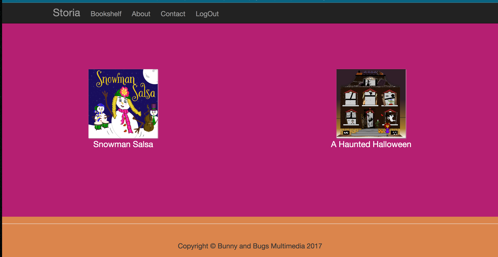
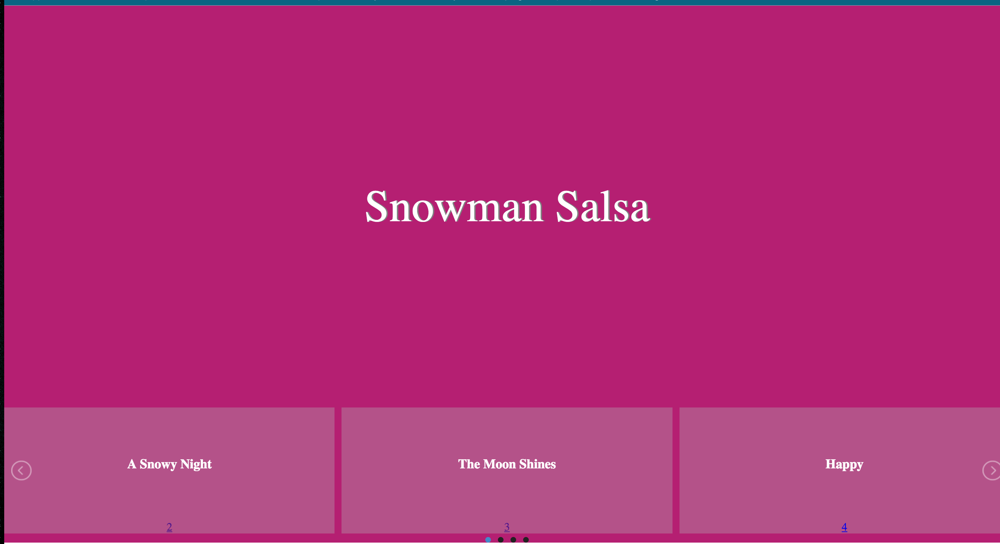
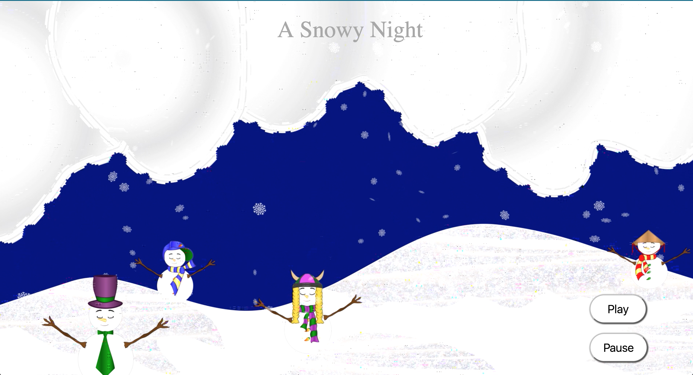
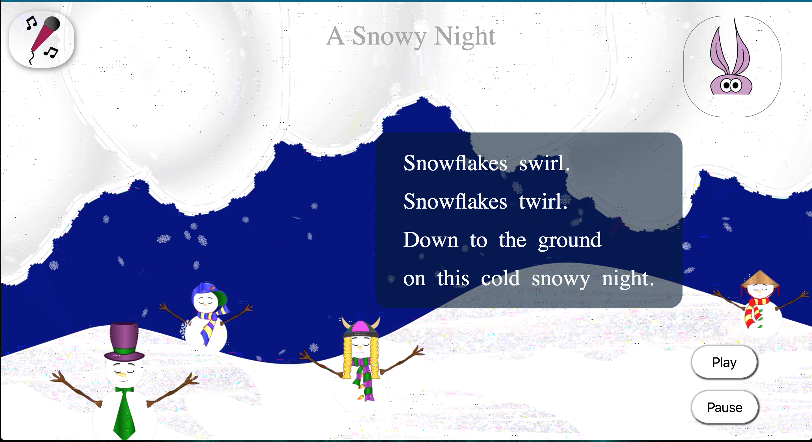

### Capstone Proposal, by Rebecca York Hanlon

### Product Name,
Storia

### Product Overview
Storia is an interactive storybook.  It allows a child to read the story, listen to the story and song, click each word to hear it, record him or herself reading the page.

To help encourage the child's reading progress and to allow the parent to over-see and encourage the child, progress reports, a reading chart with stars/badges are generated from the data collected while the child interacts with the page.

For this stage I will not focus on the perfect ux design and look of the website, but on the framework, automation and design of components.

The first stage will focus on the following:
1. Develop the process to design and show the storybook on the web with interactivity.
2. Develop the following pages (templates):  library/bookshelf, title page with navigation of the story, the storypage, website pages--home page, about, contact, log-in.
1. Collect user interface data and store in the database
2. Develop the Reading Chart that shows the users progress based on data collected from user interactions.  User interactions are collected, analyzed and sorted, visualized and then shared

### Specific Functionality
This project will begin with five pages for the website.

****General website pages****

_Types of pages and uses:_
- Home Page, carousel/slider to show apps purpose and features
- About Page
- Contact
- Register & LogIn, Log-in opens to Student's Bookshelf/Dashboard.

Here is a mockup of the Home Page:

****StoryBook Pages****

_Student's Bookshelf/Dashboard:_
- Show bookshelf (books read, books to read, recommendations), click cover to go to story
- Current storybook being read
- Avatar with Reading chart (stars and badges)
- Icons to navigate page: play|pause audio, record, avatar & reading chart
- See 'Future Features' for upcoming features

Here is a sample of the Bookself:

_Title Page/Book Contents:_

- Opening page to story
- Shows cover with title
- Slider on bottom of page to go to chapter, clickable

Here is a sample of the Title page:

_Story page_
- Listen and read the story
- Opens automatically with video/animation of that chapter of the story being told/read
- Video player with 'play','pause'
- Print of the story, read the word, and click each word to hear it pronounced
- Avatar and modal window of Reading Chart to show picture of user and stars/badges.  

Here are two samples of the Story page:

### Data Model

Auto generation of the following pages:

- Home page
- About page
- Contact page
- LogIn page
- Register page

_The assets (text, images, audio, video) for the design of these pages are stored in the Django database.  Templates are used to generate the pages, with design managed through template tags, template variable, etc_

Here is an overview of the basic website data outline:

- bookshelf  
- title page
- storybook page 

_The assets (text, audio, video, images) are stored in the Django data base.  Django templates are used/designed so each page is build/compiled by accessing the data from the database by using template tags, template variables._

Here is an overview of the basic storybook data outline:

Actions that will be collected, stored in the database, sorted/analyzed and finally visualized are the following:

- time on the page (with activity, stops at no activity at 5 min)
- clicks on each word of the story
- clicks on the audio player
- recording of story, emailed to assigned email

The Reading Chart will visually display these actions with 'merits'.  Stars and badges are used to show the students progress.

### Technical Components

- jQuery/Ajax: capturing the clicks, time on screen user data on the server and then sending to Django REST framework  
- Bootstrap: Log-in and dashboard design
- jQuery UI: accordion, droppable, sortable, date picker, select menu
- HTML, CSS (Flexbox), JavaScript(jQuery), for webpage design, interactions 
- Django API: REST framework, User, and others
- Third Party: jQuery lightSlider, by sachinchoolur.github
- MediaStream Recording API,Mozilla Developer Network

### Schedule

Time will be split between the front-end and the back-end.  At this time this is a rough estimate due to lack of knowledge about Django

****week one:****
- front-end: create the mockup of the _home page_, _story page_

- back-end: start learning Jdango, build models to store the assets, storybook information, website assets information; veiws to render to the client, templates for format the design 

****week two:****
- front-end: using Django templates, build the home_page, bookshelf_page, story_page, display_page
- back-end: automate the website pages and the storybook pages using templates, template tags and template variables; build asset models, merit models (store the interactions from the page)--keep refining the models.

****week three:****
- front-end: add the REST framework for collecting the user interactions and User interface to register, logIn, Profile, logOut
- back-end: continue to refine the models and templates, all assets (images, videos, audio, text) are stored in the database, used by the templates

****week four:****
- front-end: finish up details, prepare presentation
- back-end: finish up details, prepare presentation

### Further Work

Feature Options:
- audio player to record and send clip to email address
- secured option/modal window for parent to manage emails, calendar for progress reports that child can't access
- add play pages: unscramble words and sentences (drag and drop), color pages, matching)
- messages from child to parent and parent to child 
- finish one story book 
- change data base from db_sqlite3 to  PostgreSQL
- teacher dashboard, with environment to contact her entire class
- package this project as an online story book library, then offer publishing service to independent authors

